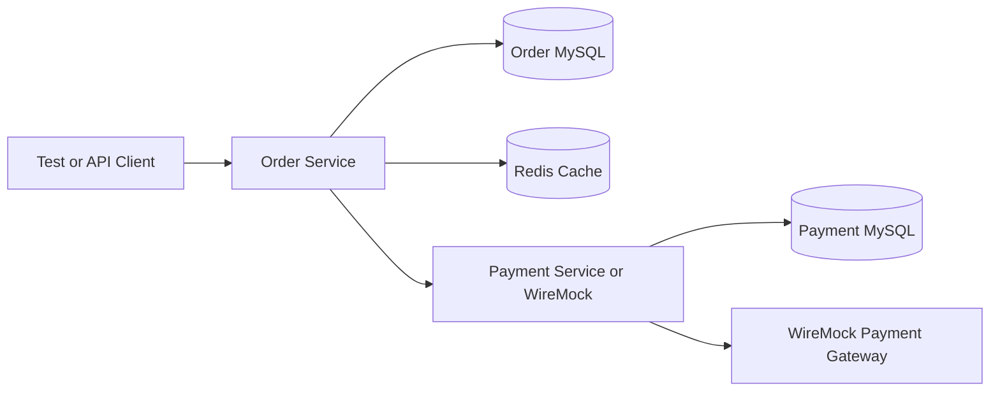

# Hermetic Testing Framework for Microservices

GitHub-ready portfolio project showing isolated, deterministic integration testing for Java microservices.

## Architecture



## Modules

- `order-service`: creates and fetches orders, calls the payment boundary, stores orders in MySQL, caches reads in Redis.
- `payment-service`: processes payments and isolates the external payment gateway behind a client.

## Tech Stack

- Java 17
- Spring Boot
- JUnit 5
- Mockito
- Testcontainers
- WireMock
- Docker Compose
- MySQL
- Redis
- GitHub Actions

## Run Locally

```powershell
.\mvn.cmd test
```

The hermetic service tests start clean MySQL and Redis containers, run Flyway migrations, mock external HTTP dependencies with WireMock, and tear everything down after the test run.

## API Summary

Order Service:

```http
POST /orders
GET /orders/{orderId}
```

Payment Service:

```http
POST /payments
GET /payments/{paymentId}
```

## Resume Bullet

Built a hermetic testing framework for Java microservices using Spring Boot, Testcontainers, Docker, Redis, MySQL, and WireMock, enabling isolated deterministic integration testing and eliminating external dependency flakiness.
